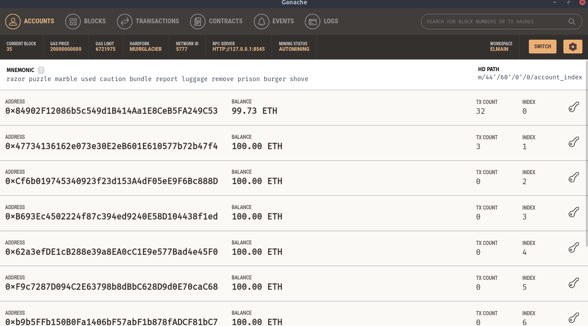
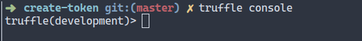
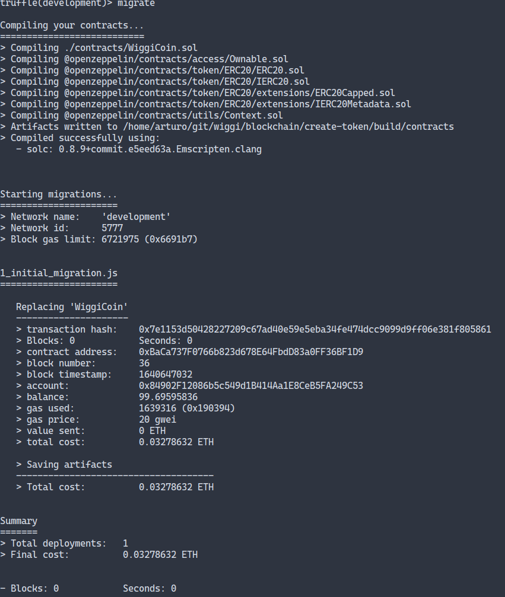
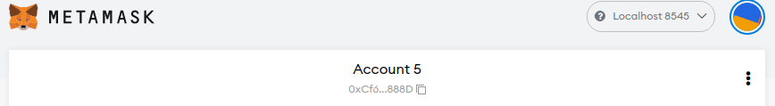
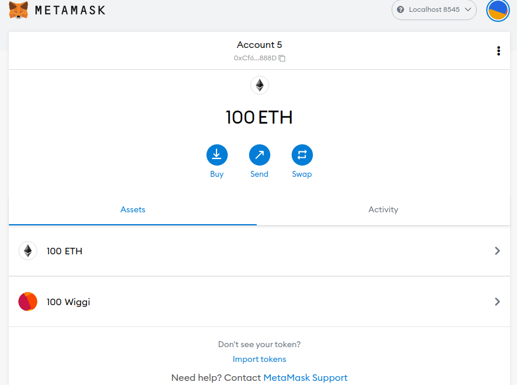

# Como crear tu primer token en la blockchain

Primero que nada me gustaría aclarar que una criptomoneda y un token son diferentes. La moneda tiene una blockchain de respaldo y un token vive dentro de la blockchain

## Requisitos

- [truffle](https://trufflesuite.com/docs/truffle/)
- [ganashe](https://trufflesuite.com/docs/ganache/)
- [nodejs](https://nodejs.org/en/)

### 1) Iniciar Ganache

Iniciaremos ganache la cual nos da una blockchain en nuestro localhost para hacer todas las pruebas necesarias, cuando este correctamente iniciado se debería de ver así



### 2) Deployar el contrato de la moneda

En una terminal situada en la raíz del proyecto escribiremos el siguiente comando

```
truffle console
```

Esto nos conectará a la blockchain en nuestro localhost y podremos interactuar con ella desde la terminal. Para asegurarnos de que estamos conectando correctamente el prompt de la terminal debe de cambiar como la siguiente imagen



Ahora solo tendremos que deployar el contrato con el siguiente comando

```
migrate
```

Cuando esto termine nos tendrá que mostrar la información de la transacción



un dato importante que tenemos que guardar es el _contract address_

### 3) Agregar a metamask

Ahora solo falta agregar la moneda a metamask, para esto nos moveremos a la red de prueba de localhost



Solo falta agregar el token a nuestro metamask , para eso daremos clic en el botón de **import tokens**. el cual está en la parte inferior


### 4) Crear tokens

Ahora solo queda crear algunos tokens para empezar a intercambiarlos. Pero antes tenemos que editar el archivo **mint-token.js** y poner la dirección a la cual le enviaremos nuestros tokens.

**Recuerda que esta dirección debe ser de la lista que nos da ganche**

En una terminal situada en la raíz del proyecto introduciremos el siguiente comando

```
npx truffle exec mint-token.js --network development
```

Si todo salió bien podrás ver en tu metamask los tokens generados


